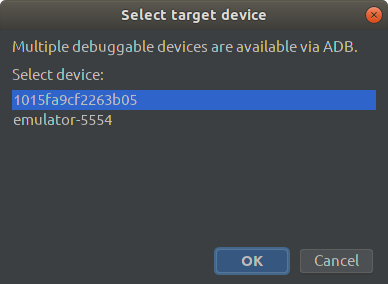
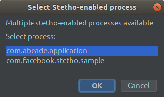

# FCM push sender
Sends push notifications using [Firebase Cloud Messaging (FCM)](https://firebase.google.com/docs/cloud-messaging).<br>
Uses [Stetho](http://facebook.github.io/stetho/)'s prefs dumpapp plugin to find the application Firebase Registration ID token in app shared preferences

# Installation
You can install the plugin from the [IntelliJ Plugin Repository](https://plugins.jetbrains.com/plugin/12104-fcm-push-sender).

Or you can download the latest binary from [releases](https://github.com/abeade/fcm-push-plugin/releases) on this repo

# Setup
You need to set the "Authorization Key" in plugin settings:


# Usage
The plugin installs one menu entry under tools menu:


And a toolbar button:


When using this option the FCM push sender dialog will be shown:


At this point the plugin tries to find the app Firebase Id in the configured shared preference key, if the id is found it will be shown, otherwise you can set it manually.

The "Remember" check allows to store the current data for next plugin executions.

### JSON type

The plugin uses the legacy [Firebase Cloud Messaging HTTP protocol](https://firebase.google.com/docs/cloud-messaging/http-server-ref) to send push notifications.

You can select "Data only" or "Full message" JSON types:

#### Data only

This type allows only to provide the `data` field of the payload.

```json
{
  "to" : "bk3RNwTe3H0:CI2k_HHwgIpoDKCIZvvDMExUdFQ3P1...",
  "data" : [Provided JSON object]
}
```

#### Full message

This type allows full control over the message payload. The plugin will add the `to` field for you.

```json
{
  "to" : "bk3RNwTe3H0:CI2k_HHwgIpoDKCIZvvDMExUdFQ3P1...",
  [Provided JSON object]
}
```

See [Firebase Cloud Messaging HTTP protocol](https://firebase.google.com/docs/cloud-messaging/http-server-ref) for more information about the HTTP syntax.

# Extra configuration
Also you can create, import and export templates:


Then you can use the templates in the send dialog:


# Notes
One of the main features of this plugin is the ability of search automatically the Firebase Registration ID token in app shared preferences using stetho dumpapp plugin, however you can disable the stetho integration in plugin settings and set the ID manually.

When using stetho to find the Id, the plugin works with connected devices on debug mode (ADB accessible). If more than one debuggable device is connected, the plugin will show a dialog to select the target device:



If the target device has more than one stetho-enabled process running, the plugin will ask to select the target process:


