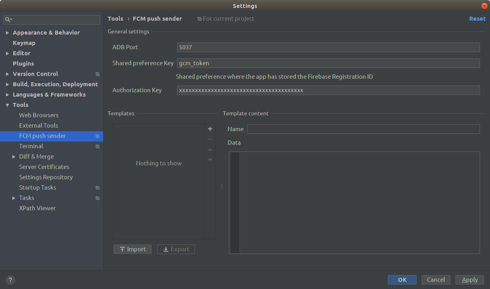
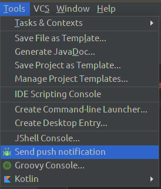
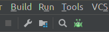
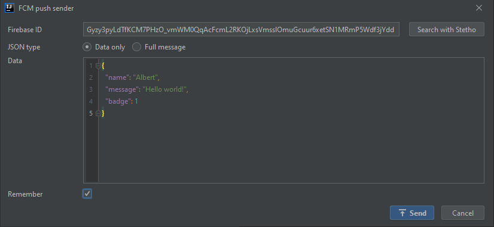
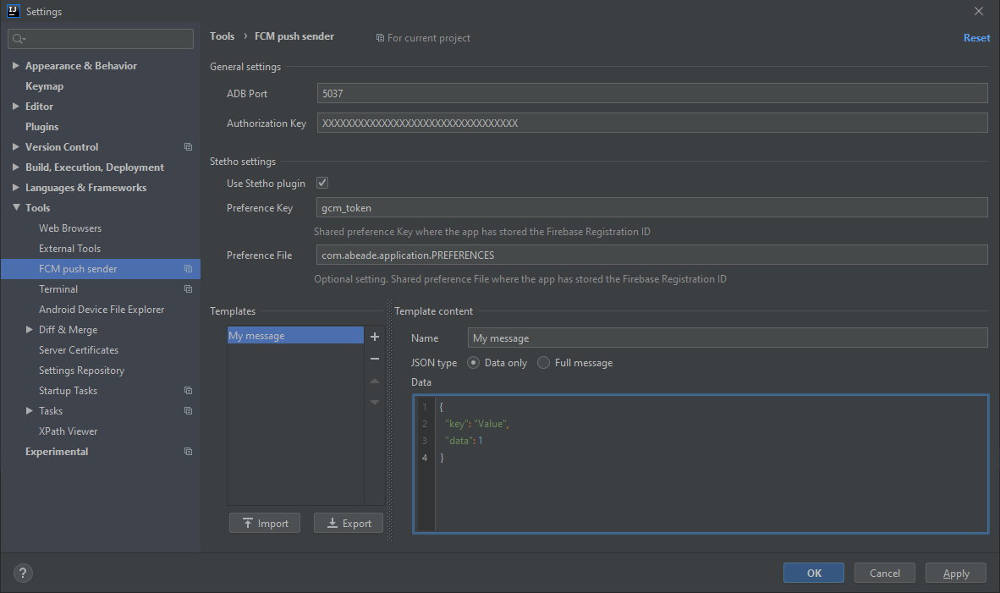
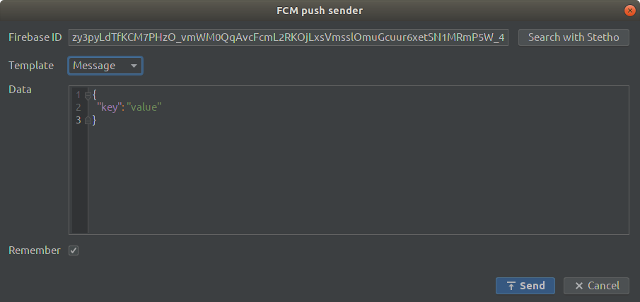

# FCM push sender
Sends push notifications using FCM. 
Uses <a href="http://facebook.github.io/stetho/">Stetho</a>'s prefs dumpapp plugin to find the application Firebase Registration ID token in app shared preferences

# Installation
You can download the latest binary from [releases](https://github.com/abeade/fcm-push-plugin/releases) on this repo

# Setup
You need to set the "Authorization Key" in plugin settings:

# Usage
The plugin installs one menu entry under tools menu:

And a toolbar button:

When using this option the FCM push sender dialog will be shown:

At this point the plugin tries to find the app Firebase Id in the configured shared preference key, if the id is found it will be shown, otherwise you can set it manually.

The "Remember" check allows to store the current data for next plugin executions.

# Extra configuration

You can create, import and export templates:

Then you can use the templates in the send dialog:

